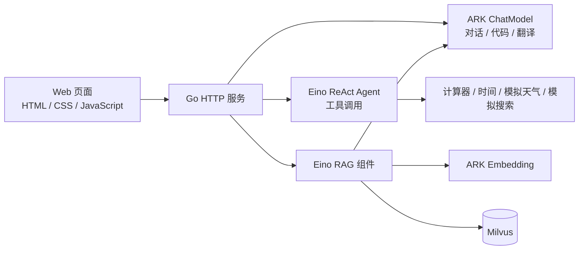
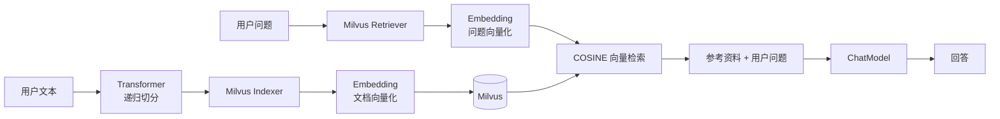
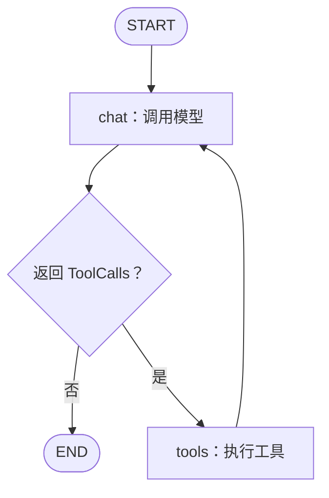

# AI 学习助手

使用 **Go + Eino + 豆包大模型 + Milvus** 构建的 AI 学习项目。提供智能对话、知识库问答、工具调用、代码助手和中英翻译，并内置一个无需前端构建工具的 Web 界面。

项目直接使用 Eino 的 ChatModel、Embedding、Transformer、Indexer、Retriever 和 ReAct Agent，便于从 HTTP 请求一路读到模型调用与向量检索。

[运行示例](#运行示例) · [快速开始](#快速开始) · [功能](#功能) · [实现结构](#实现结构) · [配置](#配置) · [接口](#接口) · [测试](#测试)

## 功能

| 功能 | 当前实现 |
| --- | --- |
| 智能对话 | 豆包模型生成回答，SSE 流式输出，前端携带最近的聊天历史 |
| 知识库问答 | 文本切分、真实 embedding、Milvus 持久化检索，再由模型生成回答 |
| 知识库管理 | 添加文本、查看分块数量、清空当前 collection 内的知识 |
| 学习工具 | ReAct Agent 按需调用计算器、时间、天气和搜索工具 |
| 代码助手 | 使用代码助手提示词，支持流式回复和代码块展示 |
| 中英翻译 | 使用翻译提示词，支持流式回复 |
| 单程序运行 | HTML、CSS、JavaScript 通过 `go:embed` 打包，前后端共用端口 |

> 计算器和时间工具执行本地计算；天气与网络搜索目前返回**模拟数据**，没有接入实时天气或搜索服务。计算器支持简单二元运算、`sqrt` 和 `pow`，不是完整的表达式解析器。

## 运行示例

以下结果来自本地启动的真实服务，使用独立演示 collection；没有使用模拟 embedding 或预置回答。

**知识库问答**

添加知识：

> 青禾项目每周三下午三点进行技术分享，地点是二楼会议室。

提问：

> 青禾项目什么时候进行技术分享，地点在哪里？

实际返回：

> 根据参考资料可知，青禾项目的技术分享时间是每周三下午三点，地点为二楼会议室。
>
> 📎 参考了 1 条知识

**工具调用**

```text
用户：请用计算器计算 25 + 30，只回复计算结果。
助手：55
```

本次验证还覆盖首页与静态资源访问、知识添加、SSE 流式回复及完成事件。模型生成的具体措辞可能随请求变化。

## 快速开始

### 1. 准备环境

- **Go 1.27 或更新版本**，以仓库 [go.mod](go.mod) 为准。
- 已启动且可访问的 **Milvus**，默认地址 `localhost:19530`。可使用已有的 Docker 部署。
- 火山方舟 **ARK API Key**、可访问的对话模型和 embedding 模型。
- **Node.js 18+** 仅用于运行前端测试，启动页面不需要 Node.js 或 npm。

本项目不会启动或安装 Milvus；需要先准备好数据库。应用初始化时也会访问 embedding 服务，因此即使只使用普通聊天，也需要上述依赖可用。

### 2. 获取项目并配置

```bash
git clone https://github.com/Jackreceive/ai-learning-agent.git
cd ai-learning-agent
```

首次配置时复制示例文件；已有 `.env` 时直接编辑，避免覆盖已有配置：

```bash
cp .env.example .env
```

填写以下必需项：

```dotenv
ARK_API_KEY=你的火山方舟APIKey
ARK_MODEL_NAME=你的对话模型ID或推理接入点ID
ARK_EMBEDDING_MODEL=你的向量模型ID或推理接入点ID
```

按 embedding 模型选择接口类型：

```dotenv
# 例如示例文件中的 vision embedding 模型
ARK_EMBEDDING_API_TYPE=multi_modal_api

# 使用文本 embedding 接口的模型时，改为：
# ARK_EMBEDDING_API_TYPE=text_api
```

不要将 `.env` 中的真实密钥提交到仓库。进程环境变量优先于 `.env` 中的同名配置。

### 3. 启动

```bash
go mod download
go run . -port 8080
```

打开 **http://localhost:8080** 即可使用前端，无需另起静态资源服务。

首次启动会探测 embedding 输出维度，创建 `ai_learning_knowledge` collection、建立 COSINE 向量索引并加载。后续启动复用已有 collection，不会自动注入教学知识。

也可以编译运行：

```bash
go build -o ai-learning-agent .
./ai-learning-agent -port 8080
```

静态资源已包含在可执行文件中；`.env` 仍从运行时工作目录读取。修改 `server/static/` 后需要重新构建，使用 `go run` 时需要重启。

### 4. 体验知识库问答

1. 在左侧选择「知识库问答」。
2. 添加文本，例如：`青禾项目每周三下午三点进行技术分享，地点是二楼会议室。`
3. 提问：`青禾项目什么时候进行技术分享？`
4. 页面显示模型回答及参考的知识片段数量。

知识保存在 Milvus 中，刷新页面或重启应用后仍可检索。页面的「条记录」指**切分后的片段数量**，不一定等于提交文本的次数。「清空」会删除当前配置 collection 中的全部知识，保留 collection 和索引。

## 实现结构

### 前后端与模型



### 知识入库与检索



这里的图表示业务流程；当前 RAG 是直接顺序调用组件，**没有额外构造 `compose.Graph`**。初始化代码在 [rag/components.go](rag/components.go)，调用代码在 [server/server.go](server/server.go)。

- 统一使用 `schema.Document`；按 Unicode 字符数切分，支持中文标点和重叠片段。
- 每个片段具有独立 ID，Indexer 内部调用 embedding 并执行 upsert。
- Indexer 和 Retriever 共享同一个 embedding 实例。
- 检索采用 COSINE 范围搜索，阈值固定为 `0.3`，最多返回 `RAG_TOP_K` 个片段。
- 读取使用强一致性，后续查询可见已完成的写入和删除。
- Collection 包含 `id`、`content`、`metadata`、`vector` 字段，向量维度由模型实际输出确定。
- 更换 embedding 模型时，应使用新的 `MILVUS_COLLECTION` 并重新导入知识。已有 collection 的模型标记或必要字段不兼容时，初始化会报错，不会自动重建或删除数据。

### 工具调用与 Graph

工具接口使用 `react.NewAgent()`。Eino 内部构造 Graph，主路径为：



当前配置 `MaxStep: 10`，限制的是图执行步数。预置 Agent 还支持直接返回工具结果的分支，但本项目没有启用它。工具接口的实际实现见 [server/server.go](server/server.go) 的 `handleTools`。

**消息状态与聊天历史的职责不同：**

| 状态 | 生命周期 | 当前用途 |
| --- | --- | --- |
| ReAct local state | 一次 `Generate()` 调用 | 保存模型调用工具、工具返回结果等中间消息 |
| 前端 `history` | 当前页面、当前模式的多轮对话 | 普通聊天、代码和翻译请求携带最近 10 条消息 |

前端切换模式或刷新页面会清空聊天历史。知识库问答和工具接口目前不接收前端历史，因此不具备跨轮上下文；Milvus 持久化知识片段，聊天历史仅保存在前端页面内存中。

### Chain 教学示例

[app/app.go](app/app.go) 中保留了：

- `DemoChain`：直接使用 `compose.NewChain()`，串联 `ChatTemplate → ChatModel`。
- `DemoGraph`：使用 ReAct Agent 演示工具调用循环图。
- `DemoRAG`：演示添加知识、检索和生成回答。

这些是可从 Go 代码调用的示例；默认 `main.go` 只启动 HTTP 服务，没有用于选择这些 demo 的命令行参数。

## 配置

所有环境变量均可写入根目录 `.env`，完整示例见 [.env.example](.env.example)。

| 变量 | 默认值 | 说明 |
| --- | --- | --- |
| `ARK_API_KEY` | 无，必填 | 火山方舟 API Key |
| `ARK_MODEL_NAME` | 无，必填 | 对话模型或推理接入点 ID |
| `ARK_EMBEDDING_MODEL` | 无，必填 | embedding 模型或推理接入点 ID |
| `ARK_EMBEDDING_API_TYPE` | `multi_modal_api` | 可选 `text_api` 或 `multi_modal_api` |
| `ARK_BASE_URL` | `https://ark.cn-beijing.volces.com/api/v3` | ARK 服务地址 |
| `MILVUS_ADDRESS` | `localhost:19530` | Milvus 连接地址 |
| `MILVUS_COLLECTION` | `ai_learning_knowledge` | 当前知识库 collection |
| `MILVUS_USERNAME` | 空 | Milvus 启用认证时填写 |
| `MILVUS_PASSWORD` | 空 | Milvus 启用认证时填写 |
| `RAG_TOP_K` | `5` | 检索结果数量上限，必须大于 0 |
| `RAG_CHUNK_SIZE` | `500` | 单个片段的字符数量上限，必须大于 0 |
| `RAG_CHUNK_OVERLAP` | `50` | 重叠字符数，满足 `0 ≤ overlap < chunk size` |

服务端口通过 `-port` 参数指定，默认 `8080`。模型请求使用真实 ARK 服务，启动探测和 RAG 操作可能产生 API 用量。

## 接口

前端与 API 同源，默认基础地址为 `http://localhost:8080`。

| 方法 | 路径 | 请求体示例 | 用途 |
| --- | --- | --- | --- |
| POST | `/api/chat` | `{"message":"你好","history":[]}` | 非流式对话 |
| POST | `/api/chat/stream` | `{"message":"你好","history":[],"mode":"chat"}` | 流式对话，mode 支持 chat/code/translate |
| POST | `/api/knowledge/add` | `{"content":"待入库的知识"}` | 切分并写入 Milvus |
| POST | `/api/knowledge/query` | `{"message":"问题"}` | 检索增强问答 |
| GET | `/api/knowledge/count` | 无 | 获取知识片段数量 |
| POST | `/api/knowledge/clear` | 无 | 清空当前 collection 的知识 |
| POST | `/api/tools` | `{"query":"计算 25 + 30"}` | 工具调用 |
| POST | `/api/code` | `{"message":"写一个 Go 示例"}` | 非流式代码助手 |
| POST | `/api/translate` | `{"message":"你好"}` | 非流式中英翻译 |

普通回答返回 `{"content":"..."}`；添加知识返回 `{"success":true,"count":1}`；数量接口返回 `{"count":1}`。业务失败可能通过 JSON 的 `error` 字段返回，调用方需检查响应内容。

流式对话示例：

```bash
curl -N http://localhost:8080/api/chat/stream \
  -H 'Content-Type: application/json' \
  -d '{"message":"用一句话介绍 Go","mode":"chat"}'
```

SSE 事件格式：

```text
data: {"content":"Go 是"}

data: {"content":"一门编程语言。"}

data: {"done":true}
```

生成出错时发送 `data: {"error":"错误信息"}`。前端会缓冲跨网络分包的事件，并正确处理 UTF-8 字符和提前断开的连接。

## 目录结构

```text
.
├── main.go                 # 程序入口与端口参数
├── config/                 # 环境变量读取及校验
├── model/                  # 官方 ARK ChatModel 初始化
├── rag/                    # Embedding / Transformer / Milvus 组件与集成测试
├── server/
│   ├── server.go           # HTTP API、静态资源路由
│   ├── static/             # 内嵌前端 HTML、CSS、JavaScript
│   └── tests/              # 前端流式处理测试
├── tools/                  # 计算器、时间、模拟天气与搜索工具
├── prompt/                 # 教学示例使用的提示词模板
├── callback/               # CLI 流式响应收集
├── app/                    # Chain、ReAct、RAG 等教学示例
├── assistant/              # CLI 助手功能
└── .env.example            # 配置模板
```

建议阅读顺序：`main.go → server/server.go → rag/components.go`，再结合 `app/app.go` 学习 Eino 的组件与编排。

## 测试

本地测试不需要真实模型或数据库：

```bash
go test ./...
go vet ./...
node --test server/tests/app.test.cjs
```

验证真实 ARK embedding 与 Milvus：

```bash
MILVUS_INTEGRATION=1 go test ./rag -run TestMilvusIntegration -count=1 -v
```

集成测试读取 `.env`，使用独立的 `ai_learning_test_*` collection，正常完成后清理。覆盖中文切分、片段 ID、重复 upsert、检索、重新连接后的持久化、清空及再次写入，并产生少量 embedding 请求。

## 常见问题

**启动时提示缺少环境变量**  
检查运行目录是否包含 `.env`，并确认三个必需的 ARK 配置已填写。

**无法连接 Milvus**  
确认 Milvus 已启动、服务就绪且端口已映射到主机，`MILVUS_ADDRESS` 与认证信息填写正确。

**embedding 初始化失败或 collection 不兼容**  
检查模型访问权限、接口类型与模型 ID。切换模型时改用新的 collection 并重新导入知识，不要把不同模型生成的向量混用。

**知识数量比添加次数多**  
统计的是片段数量；长文本会被切成多个片段。HTTP 添加接口每次生成新的文档 ID，重复提交相同文本也会新增记录。

**改了前端文件，页面没有变化**  
静态资源在编译时嵌入。重启 `go run` 或重新编译程序后刷新页面。
